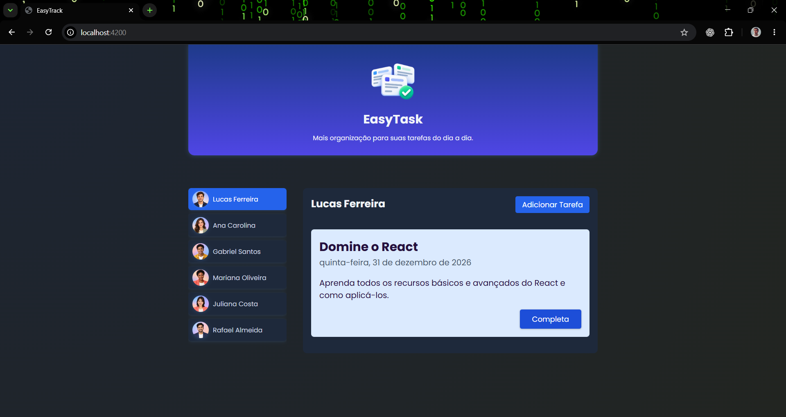
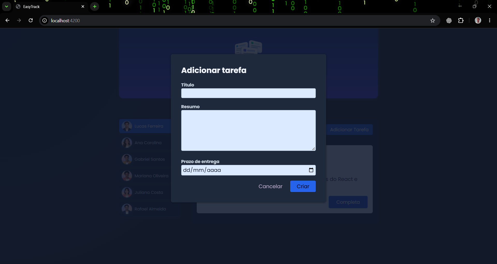

# EasyTask

Mais organização para suas tarefas do dia a dia.

O EasyTask é uma aplicação de gerenciamento de tarefas desenvolvida com Angular e TypeScript. Permite selecionar um perfil, consultar suas tarefas e adicionar novas atividades com título, resumo e prazo de entrega.

## Telas da aplicação

Seleção de perfil e visualização das tarefas com título, resumo e prazo de entrega.



Formulário para cadastrar uma tarefa com título, resumo e prazo de entrega.



## Funcionalidades

- Seleção de perfis demonstrativos.
- Exibição das tarefas do perfil selecionado.
- Cadastro de tarefas com título, resumo e data.
- Verificação de preenchimento dos campos obrigatórios.
- Conclusão de tarefas, removendo-as da lista.
- Armazenamento das tarefas no navegador com `localStorage`.
- Exibição dos prazos em português do Brasil.
- Layout com adaptações para diferentes tamanhos de tela.

## Tecnologias

- Angular 21.2.
- TypeScript 5.9.
- HTML e CSS.
- Angular Forms, com vinculação dos campos por `ngModel`.
- Vitest configurado para testes.

## Como executar

Com Git, Node.js compatível com Angular 21.2 e npm instalados, execute:

```bash
git clone https://github.com/Safforcks/EasyTask.git
cd EasyTask
npm install
npm start
```

Depois, acesse:

```text
http://localhost:4200
```

## Como usar

1. Selecione um perfil na lista de usuários.
2. Consulte as tarefas associadas ao perfil.
3. Abra o formulário para adicionar uma tarefa.
4. Preencha o título, o resumo e o prazo de entrega.
5. Clique em **Criar** para salvar.
6. Utilize o botão de conclusão para remover uma tarefa da lista.

Se algum campo estiver vazio, o formulário apresenta a mensagem **“Preencha todos os campos.”**

## Organização do código

| Local | Responsabilidade |
|---|---|
| `src/app/header/` | Cabeçalho da aplicação. |
| `src/app/user/` | Perfis demonstrativos e seleção de usuários. |
| `src/app/tasks/` | Lista de tarefas e serviço de gerenciamento. |
| `src/app/tasks/new-task/` | Formulário de cadastro e validação. |
| `src/app/tasks/task/` | Exibição e conclusão de uma tarefa. |
| `src/app/shared/card/` | Componente reutilizável de cartão. |
| `src/assets/` | Logo e imagens dos perfis. |

O `TasksService` centraliza a consulta, a criação, a remoção e o armazenamento das tarefas.

## Armazenamento e limitações

As tarefas são armazenadas no `localStorage` do navegador. Ao recarregar a página, a aplicação recupera os dados salvos.

Os perfis são demonstrativos e definidos no código. A seleção de um perfil não representa autenticação.

Na implementação atual:

- Não há backend ou banco de dados remoto.
- As tarefas não são sincronizadas entre dispositivos ou navegadores.
- Limpar os dados do site apaga as tarefas armazenadas.
- Concluir uma tarefa a remove; não existe histórico de tarefas concluídas.
- A validação verifica o preenchimento, sem bloquear datas passadas.

## Comandos disponíveis

```bash
npm start   # Inicia o servidor de desenvolvimento
npm run build   # Gera a compilação de produção
npm test   # Executa os testes configurados
```
